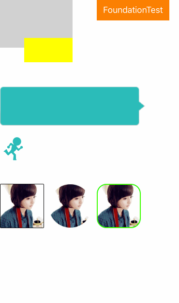

# XNCategory(整理中...)

[](https://travis-ci.org/xn4545945/XNCategory)
[](https://raw.githubusercontent.com/xn4545945/XNCategory/master/LICENSE)

**iOS useful categories.** 
**一行代码搞定一个小功能!** 

## Requirements
    - iOS 7.0+
    - Xcode 8+

## Installation

#### Installation with CocoaPods

To integrate XNCategory into your Xcode project using CocoaPods, specify it in your `Podfile`:

```ruby
source 'https://github.com/CocoaPods/Specs.git'
platform :ios, '7.0'
use_frameworks!

target 'TargetName' do
pod 'XNCategory', '~> 0.0.2'
end
```

Then, run the following command:

```bash
$ pod install
```

#### Manually

    1. Download all the files in the `XNCategory` subdirectory.
    2. Add the source files to your Xcode project.


## Usage example 

#### UIKit



绘制一个纯色的image
```objc
#import "UIImage+DrawImage.h"

[UIImage drawPlaceHolderImage]
```
创建一个拉伸不变形的image
```objc
#import "UIImage+ResizeImage.h"

[UIImage resizableImageNamed:@"chat_bg.png"]
```
UIImageView播放动画
```objc
#import "UIImageView+RunAnimation.h"

[imgIV runAnimationWithCount:6 name:@"runningman_" delatTime:0.1 repeatCount:INT_MAX];
```
便捷设置与访问frame
```objc
#import "UIView+AccessFrameComponent.h"
testView.x = 50;
testView.y = 100;
testView.width = 100;
testView.height = 100;
```
圆角
```objc
#import "UIView+RoundCorner.h"
[imgIV roundCorner];  //圆角
[imgIV1 circularClipping];  //圆形
[imgIV2 roundCornerWithBorderWidth:2.0 borderColor:[UIColor greenColor] cornerRadius:20];  //自定义
```


#### Foundation
```objc

```


## Release History

```
* 0.2
    * CHANGE: modify bugs,support ios7.
* 0.1 
    * CHANGE: modify bugs,support bitcode.
```

## License

 **XNCategory is released under the MIT license. See LICENSE for details.
